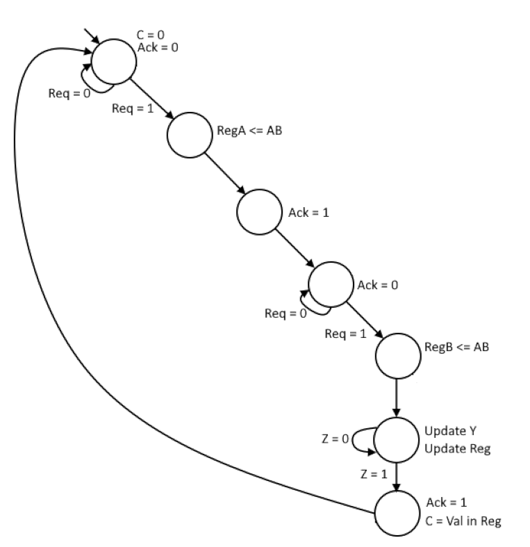

**TASK 0.B**

---
*Assume that the data-path is implemented as shown in Figure 2, that A, B, and C are
16-bit unsigned integers, and that the technology primitives available on the FPGA
are D-flip-flops and 6-input LUT’s. Estimate how many flip-flops and LUTs are
needed to implement the data-path? Briefly explain your estimate.*
---

Number of FFs = 36
* 4x Needed for encoding state (not included for data-path)
* 2x Needed for storing operands (16 FF each)

Number of 6-input LUTS = 16+32+32+4 = 84 (maybe 68)

* From MUX - this is really just 16 2:1 multiplexers
  * Each 2:1 mux needs 1 LUT.
  * **Total = 16**

* From ALU:
  * Needs to be able to do A-B and B-A. Use 2x 2:4 muxes for input selection.
    * **Total: 16 + 16 = 32**
  * Actual subtractor LUTS:
    * 16 LUTS for calculating the operation.
    * 16 LUTS for calculating Borrow outputs. (Omitted if using carry4-chains)
    * **Total: 16 + 16 = 32 (maybe 16)**
  * LUTS needed for calculating the Z-control output
    * 3x LUTS needed to compare all 16 outputs
    * 1x LUT needed to compare 3x LUT outputs.
    * **Total = 4x LUTS**

---
**TASK 2.A**
---

---
---
**TASK 2.B**
---

C should be set to a always based on the given algorithm(?)
---

